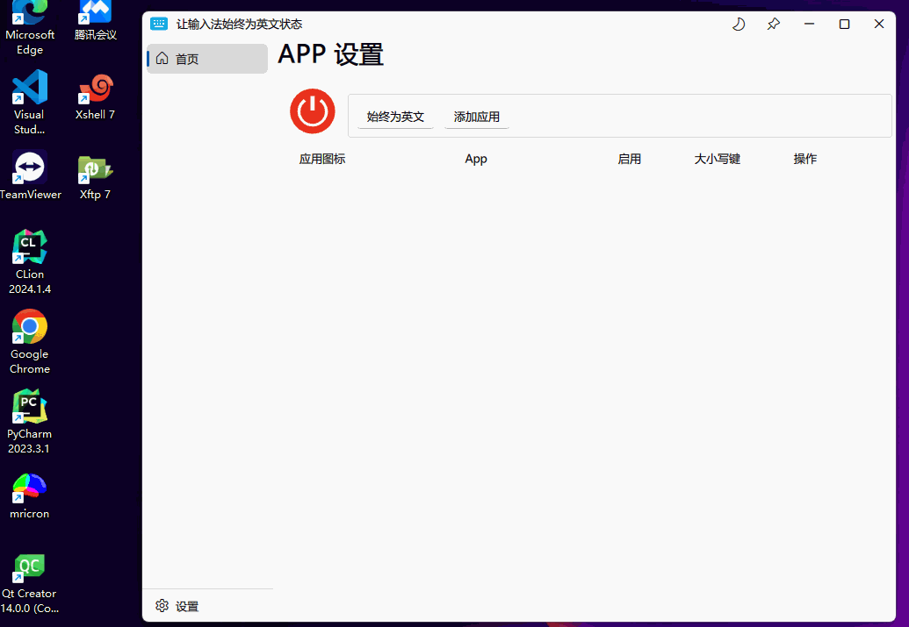

    

   

# 依赖
* Qt Core, Qt Quick, Qt QML, Qt ShaderTool, Qt 5 Compatibility Module. (必须)
* Qt LinguistTool (可选)
* Qt Svg (可选 但 Qt5 必须)

# 编译运行
1. 克隆仓库
   ~~~shell
   git clone https://github.com/ChaXxl/AlwaysEnglish.git
   ~~~

2. 构建

    * 用 `Qt Creator` 构建项目

    * 用 CMake 命令构建

        ~~~shell
        cd AlwaysEnglish
        ~~~

        ~~~shell
        cmake -DCMAKE_PREFIX_PATH=D:\Qt\6.6.3\msvc2019_64 -DCMAKE_BUILD_TYPE=Release -GNinja
        ~~~

        修改为自己的 Qt 路径

        

    * 构建好的软件保存在 `dist` 目录
